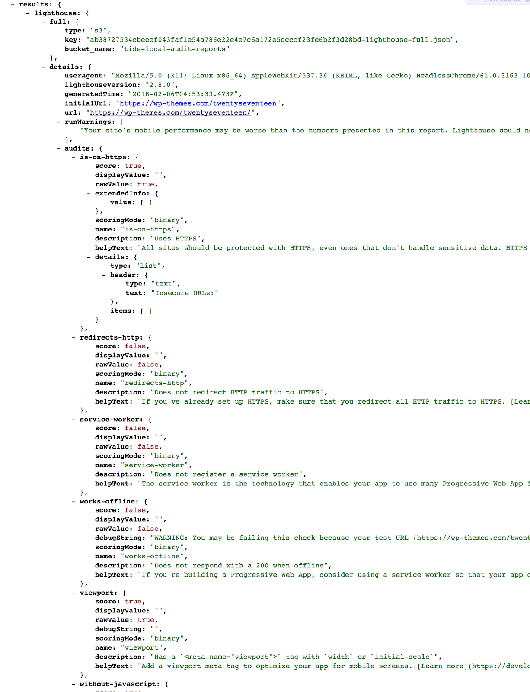

# GO Tide

  

Tide services are responsible for the following:
- The Sync Server polls the WordPress.org API's for themes and plugins to process and writes them to a queue.
- The PHPCS Server reads messages from a queue and runs reports against both plugins and themes, then sends the results back to the Tide API.
- The Lighthouse Server reads messages from a queue and runs Google Lighthouse reports against the themes only, then sends the results back to the Tide API.

## [Table of Contents](#table-of-contents)
   + [Setup](#setup)
   + [Usage](#usage)
   + [PHP_CodeSniffer (PHPCS) Server](#php-codesniffer--phpcs--server)
     - [WordPress Coding Standards (WPCS)](#wordpress-coding-standards--wpcs-)
     - [PHP Compatibility](#php-compatibility)
   + [Lighthouse Server](#lighthouse-server)
     - [Status](#status)
     - [Components](#components)
     - [Process](#process)
     - [Lighthouse Results in Tide API](#lighthouse-results-in-tide-api)
       * [Checksum Endpoint (Summary Only)](#checksum-endpoint--summary-only-)
       * [Checksum Endpoint (Details Included)](#checksum-endpoint--details-included-)
   + [Contributing](#contributing)
   + [Credits](#credits)
   + [License](#license)

### Setup
@todo

### Usage

### PHP_CodeSniffer (PHPCS) Server
@todo

#### WordPress Coding Standards (WPCS)
@todo

#### PHP Compatibility
@todo

### Lighthouse Server
This section outlines the components included in the Lighthouse integration with Tide, demonstrates how the integration processes Lighthouse audits of WordPress.org themes, and provides examples of the Tide API with Lighthouse audit results.

#### Status
Lighthouse auditing of WordPress themes has been integrated by running each theme from wp-themes.com through the Lighthouse CLI, stores the full report, and includes the summary results and a link to the full report in the Tide API. This currently functions locally, XWP is working to get this running on GCP.

#### Components
The following outlines the components added to Tide in order to integrate Lighthouse in overall Tide auditing of WordPress themes.
1. Docker Container
   - Lighthouse CLI
   - Lighthouse Server binary (lighthouse-server)
   **Note:** Uses an Alpine Image with working Chromium version. Produces consistent results with Lighthouse Chrome extension. Allows reduced image size of 432MB.
2. Go Lighthouse Server Source Code
   - `cmd/lighthouse-server` for binary
   - `src` for packages
   - `vendor` for imported packages
     - [github.com/nanobox-io/golang-scribble](https://github.com/nanobox-io/golang-scribble)
     - [github.com/wptide/pkg](https://github.com/wptide/pkg)
   - Running Tide cluster

#### Process
The following demonstrates how a WordPress theme is run through a Lighthouse audit and has its results stored and returned via the Tide API.
1. `tide-cluster`
   - Starts all Tide services and listens...

   
2. `lighthouse-server`
   - authenticate with Tide API    

   
   - polls a job queue (SQS) for messages to process

   
   - downloads theme and calculates checksum

   
   - runs source through `gocloc` to get code information
   - scans source for Theme header information (required for Lighthouse Report)

   
   - runs theme through `lighthouse` at `https://wp-themes.com/<theme-slug>` and keeps polling for next job.

   
   - take full report and generate detailed report
   - saves full report to a file store (S3)

   
   - grabs subset of results `reportCategories` with only:
     - category name
     - score
     - Description

   
   - bundles summary result and reference to full report as a message payload
   - payload sent to Tide API instance

   

#### Lighthouse Results in Tide API
The following are example responses from the Tide API showing a summary of a Lighthouse report and a detailed result of a Lighthouse report.

##### Checksum Endpoint (Summary Only)
https://tide.local/api/tide/v1/audit/ab38727534cbeeef043faf1e54a786e22e4e7c6a172a5ccccf23fe6b2f3d28bd?standards=lighthouse

##### Checksum Endpoint (Details Included)
https://tide.local/api/tide/v1/audit/ab38727534cbeeef043faf1e54a786e22e4e7c6a172a5ccccf23fe6b2f3d28bd?standards=lighthouse&details=all

**Note:** Results for details is exactly the same as the output from a Lighthouse CI report.

### Contributing
Please read [CONTRIBUTING.md](CONTRIBUTING.md) for details on our code of conduct, and the process for submitting pull requests to us.

### Credits
Props: [@rheinardkorf](https://github.com/rheinardkorf), [@valendesigns](https://github.com/valendesigns)

### License
Tide utilizes an [MIT license](https://github.com/xwp/go-tide/blob/master/LICENSE).
